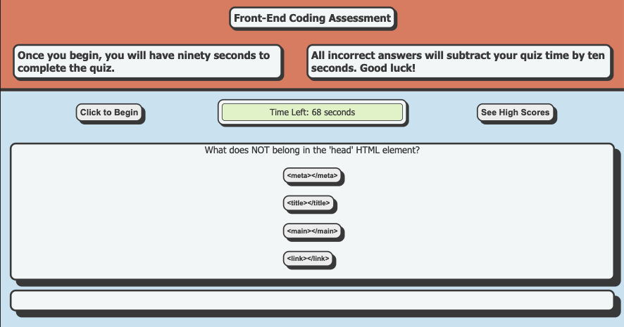

# Timed Coding Quiz

## Description

The quiz app displays questions, processes user answers, manages the timer, calculates scores, and saves scores to local storage. After completing the quiz, the user may save their score and initials to view r and compare it with other players' scores within that browser session.

## Table of Contents

- [Preview](#preview)
- [Deployed Application](#deployed-application)
- [User Story](#user-story)
- [Features](#features)
- [Acknowledgments](#acknowledgments)
- [License](#license)
- [Badges](#badges)

## Preview


## Deployed Application

[Timed Coding Quiz Link](https://victoriamcn.github.io/Timed-Coding-Quiz/)

## User Story

```
AS A coding boot camp student
I WANT to take a timed quiz on coding fundamentals that stores high scores
SO THAT I can gauge my progress compared to my peers
```

## Features

1. Click the "Click to Begin" button to start the timer and loop the quiz questions.
2. Click the "See High Scores" Button to view any scores from local storage.
3. Each correct answer adds 100 points to the score.
4. Each incorrect answer subtracts 10 seconds from the timer.
5. When the quiz is complete, the user can save their score by adding their initials.

## Acknowledgments

### Special Thanks
- My instructor at Georgia Tech Coding Bootcamp, [Saurav Khatiwada](https://github.com/khatiwadasaurav)

### Tutorials
- CodePen: [How To - JavaScript Countdown Timer](https://codepen.io/yaphi1/pen/KpbRZL?editors=0010)
- Simple Steps Code: [How to Make a Simple JavaScript Quiz](https://simplestepscode.com/javascript-quiz-tutorial/)
- StackOverflow:[JavaScript: How Do I save the Score and Initials once the page is refreshed and add more score and initials to the existing ones.?](https://stackoverflow.com/questions/66488667/javascript-how-do-i-save-the-score-and-initials-once-the-page-is-refreshed-and)
- W3 Schools: [HTML DOM Document createElement()](https://www.w3schools.com/jsref/met_document_createelement.asp)
- W3 Schools: [JSON Array Literals](https://www.w3schools.com/js/js_json_arrays.asp)
- W3 Schools: [JavaScript Objects](https://www.w3schools.com/js/js_object_definition.asp)
- Looka: [50 Color Combination You Need to Use in 2023](https://looka.com/blog/color-combinations/)

### Code Examples
-  CodePen:[Dynamic JS Quiz by Gary Carino](https://codepen.io/gcarino/pen/AaJBOo). Though Gary used jQuery, it helped me think through what needed to happen.
- YouTube: [Build a Quiz App Playlist by James Q Quick](https://www.youtube.com/watch?v=u98ROZjBWy8). James had different approaches, but the concept was similar enough to help me write my code.

## License

[](https://opensource.org/licenses/MIT) This project is licensed under the MIT License - see the LICENSE.md file for details.

## Badges


